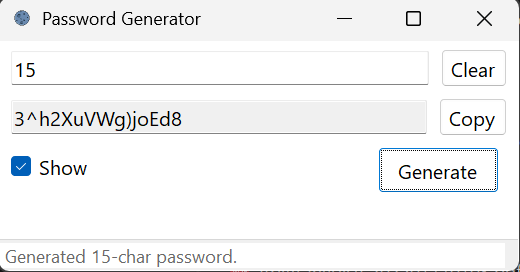

# Password Generator App 🗝️

A lightweight WinForms app that on the surface looks like a simple password generator…
but hides a little gimick.

---

## Features

* **Password generator**
  Enter a number between **8–128** and it will generate a random password of that length using `RandomNumberGenerator` (cryptographically stronger than `Random`).

* **Keyword lookup (the hidden gimmick)**
  Instead of entering a number, type a keyword like `secretGitHubPassword1` or `gmailPassword` and it will fetch a saved password.

  * If the keyword doesn’t exist, the output box unlocks so you can type in a password and save it for future use.
  * Passwords are stored locally using **Windows DPAPI**, so they’re tied to your Windows account and not plain-text on disk.

* **Quality-of-life touches**

  * One-click **Copy** to clipboard
  * **Reveal** checkbox to show/hide
  * **Clear** button to reset input/output
  * Status bar feedback (e.g., “Copied ✓”, “Saved new password…”)

---

## Why?

Because it’s fun.
At first glance, it’s just a password generator. But the surprise functionality — the mini “vault” — makes it feel like a hidden Easter egg.

---

## What It Is *Not*

This is **not a production password manager**.
There’s no sync, no mobile companion, no browser autofill. It’s not meant to compete with tools like Bitwarden or 1Password.

It’s simply a neat little experiment that hides more functionality than it first reveals.

---

## Getting Started

1. Clone the repo.
2. Open in Visual Studio.
3. Build + run.

Requirements:

* .NET 6.0+
* Windows (uses DPAPI for local storage)

---

## Screenshots

---

